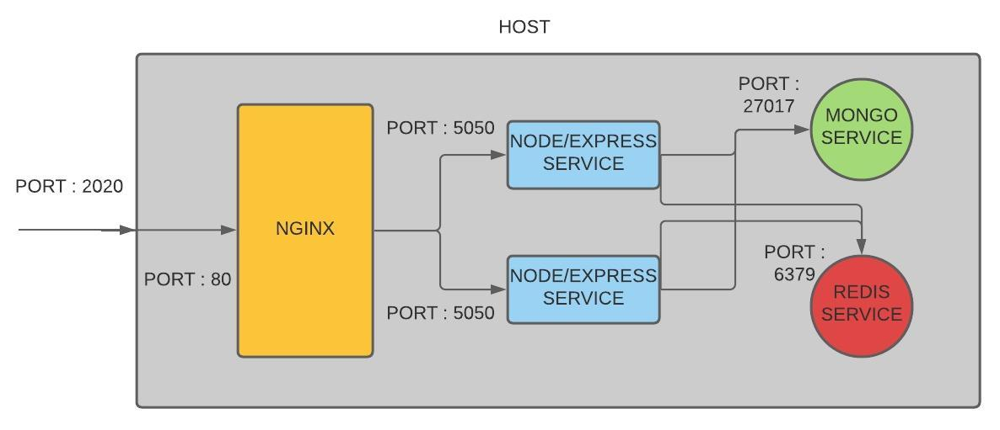

# __NODE-EXPRESS APP USING DOCKER__

Building an Express App and integrating the same with Docker container and setting up the workflow so that we can develop the the app exclusively inside the docker container instead of doing it locally on our machine

---

## __NODE-EXPRESS APP ARCHITECTURE__

The basic architecture of the Node-Express App is as follows :



1. The user sends request to the Node-Express App on port 2020.
2. The request then gets diverted to the Nginx server on port 80 which behaves like a load balancer which would spin up Node/Express services as and when the requests increase.
3. The load balancer then sends the request to our Node/Express service on port 5050 which handles all of the request-response functionalities.
4. The Node/Express service internally communicates with 2 other services :
    - REDIS DATABASE - This service is basically to maintain user sessions and to help with user authentication. Node/Express service uses the default port 6379 to communicate.
    - MONGO DATABASE - This service is to basically store the the blogpost details and user details.Node/Express service uses the default port 27017 to communicate.

---

## GETTING STARTED

```python

npm init -y
npm install express
npm install nodemon --save-dev

create index.js file
```

---

## CREATE DOCKER FILE

1. Create Dockerfile and add the base image which is node along with the version preferred.
2. Set the working directory path to /app and copy the package.json file to the current working directory.
3. Copy all the remaining files from the current working directory to the current working directory.
    - Make sure to create a .dockerignore file that will contain all the unnecessary files and folders that you do not want to copy to the docker image.
    - This is done as an optimization technique so that when we do docker build it knows that nothing has changed so it returns the cached image as a result of this step.
4. We then mention the RUN command which is basically a bash script with if statement to make sure we do not install the development dependencies during the production mode.
5. We need to mention the default command to execute, this will be over writtemn based on development or production phase.

```python
FROM node:15
WORKDIR /app
COPY package.json /app
ARG NODE_ENV
RUN if[ "$NODE_ENV" = "development" ]; \
    then npm install; \
    else npm install --only=production; \
    fi
COPY . ./
CMD ["node","index.js"]
```

---

## ENVIRONMENT (ENV) VARIABLES

We want to give the user the permission to decide the port number for the docker container, thus we do not hardcode the port number of the docker container, but we create a .env file where we will specify all the environment variables that are being used through out the codebase.

We can write them in the Dockerfile itself but in case of a lot of environment variables used the Dockerfile will get complicated to understand, hence we create a seperate file for all the environment variables and send the path of the file as a parameter while running the docker container.

```python
# Contents of .env file : 
PORT=5050

# parameter to be passed in the docker run command
--env-file ./.env
```

---

## VOLUMES IN DOCKER CONTAINER

These volumes are used in order to have persistent storage inside the docker container.
It allows us to sync the local file on the system with the files present in the docker container

We are going to use bindmount , it allows us to sync our folder in the container with the specified folder on the host machine.

```python
# Example : 
-v PathToFolderInHostMachine:PathToFolderInDockerContainer

# $(pwd) refers to the current working directory on the host machine and /app referes to the folder where all the files are present in the docker container.We also add another parameter along with the path which refers to read only bindmount.
# read only bindmount in necessary where we do not want to create files or folders in our local system when we create files/folders in the docker container.
-v $(pwd):/app:ro

# We also add another volume which refers specifically to the node_modules folder so that there is no overwriting taking place due to the bindmount shown above, in case of deletion of the node_module folder in the local system.
-v /app/node_modules
```

We also need to use nodemon package inorder to re-run the index.js file as when there is any changes done to any file.

- Nodemon is a node package which will run the file everytime there is any change done to any of the file present in the folder instead  of us manually running the node command everytime.

```json
//  We need to add the below code in the package.json file under scripts
"scripts": {
    "start":"node index.js",
    "dev":"nodemon -L index.js"
  }
```

---

## DOCKER-COMPOSE FILE

In case of one docker container we need to run the command :

```python
# Running the docker contaniner by giving it a name, specifying the port we want the docker to listen to which is mentioned in the .env file , specifying the volumes and also adding the port number so that there is communication from the outside world to the docker.

sudo docker run -v $(pwd):/app:ro -v /app/node_modules --env-file ./.env -p 2020:5050 -d --name node-app node-app-image

# left value of the port number is of the localhost port 
# right value is the port our app is listening to
```

This command is long and gets complicated if we have more than one docker container in our project.Hence we make use of docker-compose.yml file to automate the entire process of running the docker containers.

```yaml
# Contents of the base docker-compose yaml file
version: "3"
services: 
    # this is one service which is our node app container
    node-app: 
        build: .
        ports:
            - "2020:5050"
        env_file: 
            - ./.env
        # this actually makes sure that the mongo container starts first and only then the node-app container starts.
        depends_on: 
            - mongo
            
    # this is second service which is our mongo db container
    mongo:
        image: mongo
        environment:
            - MONGO_INITDB_ROOT_USERNAME={Username}
            - MONGO_INITDB_ROOT_PASSWORD={Password}
        volumes:
            - mongo-db:/data/db
        ports:
            - "27017:27017"
    
    # this is the redis database container
    redis:
        image: redis

volumes:
    mongo-db:
```

```yaml
# Contents of development phase docekr-compose yaml file
# Under the args , we pass all the arguments that we will be passing to the command
version: "3"
services: 
    node-app: 
        build:
            context: .
            args:
                NODE_ENV: development
        volumes:
            - ./:/app:ro
            - /app/node_modules
        environment:
            - NODE_ENV = development
            - MONGO_USER = {Username}
            - MONGO_PASSWORD = {Password}
            - SESSION_SECRET = {Secret String}
        command: npm run dev
    
    mongo:
        environment:
            - MONGO_INITDB_ROOT_USERNAME = {Username}
            - MONGO_INITDB_ROOT_PASSWORD = {Password}
```

```yaml
# Contents of production phase docker-compose yaml file
# Under the args , we pass all the arguments that we will be passing to the command
version: "3"
services: 
    node-app:
        build:
            context: .
            args:
                NODE_ENV: production
        environment:
            - NODE_ENV=production
        command: node index.js
        
        
```

Docker-compose does not rebuild the image whenever we run the command :

```python
sudo docker-compose -f docker-compose.yml -f docker-compose.dev.yml up -d
    OR
sudo docker-compose -f docker-compose.yml -f docker-compose.prod.yml up -d
```

docker compose looks for an image with name "project-folder_image-name" format, if there is image already present it does not rebuild, else it builds the image.There are chances that we might work with a stale image, because despite any chanegs done in any file the docker-compose command will not rebuild the image for the simple reason that the image is already present.

We need to explicitly tell the docker compose to rebuild the image in case of any modifications done to any file.Hence we pass another parameter to the command which forces the docker compose to rebuild the image.

```python
# This is the command in case of force rebuild of the docker image for production phase.
# In case of production phase we do not have bindmount inorder to sync the files, hence we will have to forcefully rebuild the docker image to reflect the necessary changes.

sudo docker-compose -f docker-compose.yml -f docker-compose.dev.yml up -d --build
    OR
sudo docker-compose -f docker-compose.yml -f docker-compose.prod.yml up -d --build
```

We have created one base docker-compose file which is common across development and production phase.

We have also made two seperate files each for development and production phase.Based on the phase we can include that particular file and run our docker compose command.

```python
# If we want run the development phase then we need to include the docker-compose file specific to development
sudo docker-compose -f docker-compose.yml -f docker-compose.dev.yml up -d

# If we want run the production phase then we need to include the docker-compose file specific to production
sudo docker-compose -f docker-compose.yml -f docker-compose.prod.yml up -d
```

---

## MONGO SERVICE

We have added the mongo service to our docker-compose base file. We are using the base image itself so we do not need to seperately build it.Hence we pull the image as it is from the docker hub.

We then have added few environment variables such as username and password. We also create named volume to store persistently the database that we build. We do not create an anonymous volume like the one we did for node_modules because there are chances of deleting anonymous volumes, hence we make use of named volumes.

```yaml
# this is mongo service which is our mongo db container
    mongo:
        image: mongo
        environment:
            - MONGO_INITDB_ROOT_USERNAME={username}
            - MONGO_INITDB_ROOT_PASSWORD={password}
        volumes:
            - mongo-db:/data/db
```

We then run the docker-compose up command and enter into our mongo container

```python
# running the build command
sudo docker-compose -f docker-compose.yml -f docker-compose.dev.yml up -d --build

# fetch the mongo container name 
sudo docker ps

# enter the mongo container 
sudo docker exec -it {mongo_container_name} mongo -u "{username}" -p "{password}"

# create a new database
use mydb

```

The databse we have created called "mydb" stays running until the docker container is up and running. Once we call the docker-compose down command along with -v flag the database gets deleted and if we bring up the docker container again, we will not be able to see the database that we had created.

Hence we make use of volumes similar to the node-app, volumes help us in keeping the data persistently.When we want to delete or bring down the containers we cannot pass in the -v flag because it will then remove all the anonymous and also the named volumes.

Hence we make use of docker prune command after bringing up the docker container so that only the unused local volumes will be removed and all the named and necessary volumes will still be present.

---

## CONNECTING EXPRESS APP WITH MONGO

We install a library called mongoose which will help us to connect to our mongo db.

We make use of a function call in order to conenct with the mongo db so that we can retry to connect with it in case of any connection issue. In order to satisfy this we make use of setTimeout() function which takes in two parameters one being the function call and the other being the time duration after which it needs to retry.

```python

const mongoose = require('mongoose');
const {MONGO_USER, MONGO_PASSWORD, MONGO_IP, MONGO_PORT} = require("./config/config");

const mongoURL = `mongodb://${MONGO_USER}:${MONGO_PASSWORD}@${MONGO_IP}:${MONGO_PORT}/?authSource=admin`;

const connectWithRetry = () => {
    // connecting our express app with the mongo database with the help of mongoose library
    mongoose
        .connect(mongoURL, {
            useNewUrlParser: true,
            useUnifiedTopology: true,
            useFindAndModify: false
        })
        .then(() => console.log("Successfully Connected to Mongo DB"))
        .catch((e) => {
            console.log(e)
            setTimeout(connectWithRetry, 5000)
        });   
}
```

The issue with the above code is that the IP Address might change whenever we call the docker-compose down and up.Also in order to know the IP address we have get into docker inspect everytime.

Hence in order to avoid the searching of the IP Address everytime we make use of the docker service name that we have used in our docker-compose file.Using this would automatically search for the IP Address used by that container.This works because of the DNS created by our docker container, and works only with the networks created by us and does not work with the local bridge networks.

We also mention the environment variables needed in a config file and make use of the same while connecting with the mongo db.

```js
// this is the config file which mentions all the values that are going to be used while connecting with our mongo db.
module.exports = {
    MONGO_IP: {Mongo_Service_Name},
    MONGO_PORT: {Port number default at 27017} ,
    MONGO_USER: {"Username"},
    MONGO_PASSWORD: {"Password"}
};
```

```python
const mongoose = require('mongoose');
const {MONGO_USER, MONGO_PASSWORD, MONGO_IP, MONGO_PORT} = require("./config/config");

const mongoURL = `mongodb://${MONGO_USER}:${MONGO_PASSWORD}@${MONGO_IP}:${MONGO_PORT}/?authSource=admin`;

mongoose
    .connect(mongoURL, {
        useNewUrlParser: true,
        useUnifiedTopology: true,
        useFindAndModify: false
    })
    .then(() => console.log("Successfully Connected to Mongo DB"))
    .catch((e) => console.log(e));
```

As discussed earlier we make use of the `depends_on` flag where we mention the mongo service name. This makes sure to run the mongo container first and then it starts the node-app container. It does not worry if the mongo is initialzed or not.

Hence we come up with a logic where we keep trying to connect to mongo until its up and running.This job is handled by mongoose library itself, but it tries to conenct to mongo only for 30sec, after which it crashes.

---

## USING REDIS FOR MAINTAINING SESSIONS

We make use of redis database to track the users and allow them to access the different functionalities based in their login status.

For this we create sessions and add in user details as and when he sends a signup or a login request.We also set few parametes in order make sure that the session stays alive and also regarding the access to requests etc.

```js
module.exports = {
    REDIS_URL:  {Redis Container Name},
    REDIS_PORT: 6379, 
    // Secret is a string that is set in the docker compose file belonging to the development phase
    SESSION_SECRET: process.env.SESSION_SECRET
};
```

```js
const session = require('express-session');
const redis = require('redis');

const {
    REDIS_URL,
    REDIS_PORT,
    SESSION_SECRET
} = require("./config/config");

let RedisStore = require('connect-redis')(session);
let redisClient = redis.createClient({
    host: `${REDIS_URL}`,
    post: `${REDIS_PORT}`
})

// this is a middleware for using the redis sessions
app.use(session({
    store: new RedisStore({
        client: redisClient
    }),
    secret: `${SESSION_SECRET}`,
    cookie: {
        secure: false,
        resave: false,
        saveUninitialized: false,
        httpOnly: true,
        maxAge: 30000000
    }
}))

```

---

## RUNNING DOCKER CONTAINER

```python
# Start the docker if not already running
sudo service docker start

# Building or re-building the docker container in case of addition of any new image is done by :
# The below command is used when the docker container is up and running , and we have added new image or dependencies, then we should not be using the same old anonymous volume.
# The -V flag used is actually to renew the existing anonymous volumes  
# If you want to run the docker container for development phase : 
    sudo docker-compose -f docker-compose.yml -f docker-compose.dev.yml up -d --build -V
# If you want to run the docker container for production phase : 
    sudo docker-compose -f docker-compose.yml -f docker-compose.prod.yml up -d --build -V

# Running the docker container using the docker-compose
# If you want to run the docker container for development phase : 
    sudo docker-compose -f docker-compose.yml -f docker-compose.dev.yml up -d
# If you want to run the docker container for production phase : 
    sudo docker-compose -f docker-compose.yml -f docker-compose.prod.yml up -d

# Stopping the docker container
# If you want to stop the docker container of development phase : 
    sudo docker-compose -f docker-compose.yml -f docker-compose.dev.yml down
# If you want to stop the docker container of production phase: 
    sudo docker-compose -f docker-compose.yml -f docker-compose.prod.yml down

# To delete all the unnecessary volumes we make use of :
    sudo docker volume prune
# Run this comman after you start the docker container , so it will delete all the local volumes which are not used, hence we will not loose any named volumes which are currently required.

# To view the details of the docker container we use, this gives us information such as name of the container, port used, how long has it been running
sudo docker ps
# To view the contents of the docker container we use 
sudo docker exec -it {docker_container_name} bash

```

---

## SETTING UP PRODUCTION ENVIRONMENT

1. Initialize a GIT Repository
2. Add all the files necessary into the git repository
3. Set up a virtual machine with ubuntu operating system
4. SSH into the virtual machine using any software such as Putty
5. Install docker if not already installed using :

    ```python
        curl -fsSL https://get.docker.com -o get-docker.sh
        sh get-docker.sh
    ```

6. Install docker-compose using :

    ```python
        sudo curl -L "https://github.com/docker/compose/releases/download/1.29.2/docker-compose-$(uname -s)-$(uname -m)" -o /usr/local/bin/docker-compose
        sudo chmod +x /usr/local/bin/docker-compose
    ```

7. Create environment variables in the linux system so that the docker conatiner can read them instead of hardcoding the environment variables.

    ```python
        # Create a .env file which will contain all the environment variables.
        ENV_VARIABLE_NAME=variable_name

        # Edit .profile file by adding the following command to the end of the file
        # This is one way to set environment variables from the .env file
        set -o allexport; source /path/to/.env; set +o allexport
    ```
